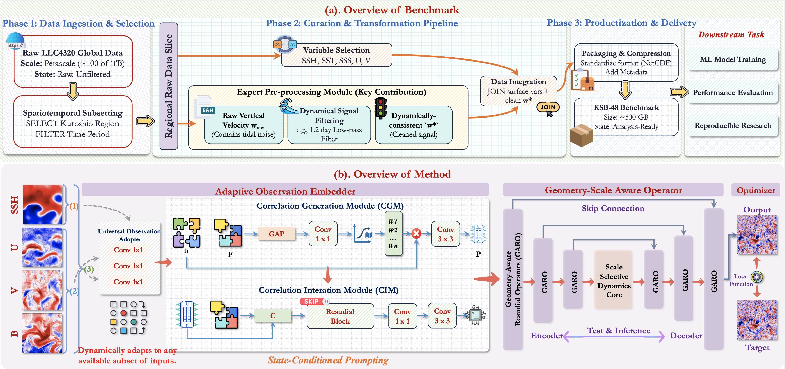
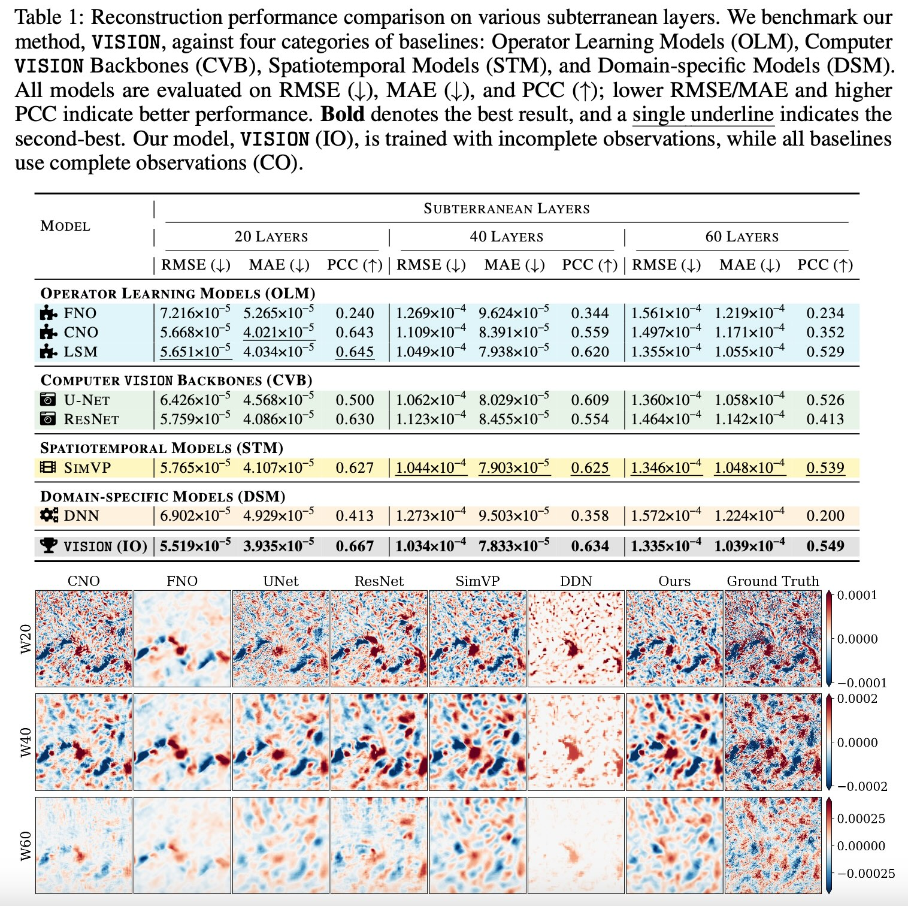
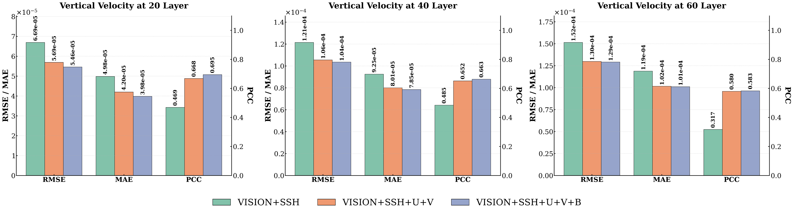

 
 # <p align=center> VISION: Prompting Ocean Vertical Velocity Reconstruction from Incomplete Observations</p>

 <div align="center">
 
[](https://arxiv.org/abs/2502.00338)
[](https://huggingface.co/YuanGao-YG/OneForecast/tree/main)

</div>
<div align=center>

</div>


---
>**VISION: Prompting Ocean Vertical Velocity Reconstruction from Incomplete Observations**<br>  [Yuan Gao](https://scholar.google.com.hk/citations?hl=zh-CN&user=4JpRnU4AAAAJ&view_op=list_works&sortby=pubdate)<sup>† </sup>, [Hao Wu](https://easylearningscores.github.io/)<sup>† </sup>, [Qingsong Wen](https://sites.google.com/site/qingsongwen8/), [Kun Wang](https://scholar.google.com/citations?user=UnyqjWQAAAAJ&hl=en&oi=sra), [Xian Wu](https://scholar.google.com.hk/citations?user=lslB5jkAAAAJ&hl=zh-CN), [Xiaomeng Huang](https://scholar.google.com.hk/citations?user=yH9OkqYAAAAJ&hl=zh-CN) <br>
(† Equal contribution<br>)


> **Abstract:** *Reconstructing subsurface ocean dynamics, such as vertical velocity fields, from incomplete surface observations poses a critical challenge in Earth science, a field long hampered by the lack of standardized, analysis-ready benchmarks. To systematically address this issue and catalyze research, we first build and release KD48, a high-resolution ocean dynamics benchmark derived from petascale simulations and curated with expert-driven denoising. Building on this benchmark, we introduce VISION, a novel reconstruction paradigm based on Dynamic Prompting designed to tackle the core problem of missing data in real-world observations. The essence of VISION lies in its ability to generate a visual prompt on-the-fly from any available subset of observations, which encodes both data availability and the ocean's physical state. More importantly, we design a State-conditioned Prompting module that efficiently injects this prompt into a universal backbone, endowed with geometry- and scale-aware operators, to guide its adaptive adjustment of computational strategies. This mechanism enables VISION to precisely handle the challenges posed by varying input combinations. Extensive experiments on the KD48 benchmark demonstrate that VISION not only substantially outperforms state-of-the-art models but also exhibits strong generalization under extreme data missing scenarios. By providing a high-quality benchmark and a robust model, our work establishes a solid infrastructure for ocean science research under data uncertainty. Our codes are available at: ~\url{https://github.com/YuanGao-YG/VISION}.*
---

## News 🚀

* **2025.09.26**: Inference codes, pre-trained weights, and demo of KD48 benchmark are released.
* **2025.09.26**: Paper is released on [arXiv].

## Notes

The intact project is avilable on [Hugging Face], you can find the pretrained models, test data on Hugging Face and put them in the same location.


## KD48 Benchmark

</div>
<div align=center>

</div>


## Quick Start

### Installation

- cuda 11.8

```
# git clone this repository
git clone https://github.com/YuanGao-YG/VISION.git
cd VISION

# create new anaconda env
conda env create -f environment.yml
conda activate vision
```


### Inference

1. Inference using Incomplete Observations (SSH)

2. Inference using Incomplete Observations (SSH + U + V)

2. Inference using Complete Observations (SSH + U + V + B)


### Model Training**

The training codes will be released after the paper is accepted.


## Performance
### Comparison with Baseline Models

</div>
<div align=center>

</div>

### Dynamic Prompting Reconstruction Evaluation

</div>
<div align=center>

</div>


## Citation

```

```

## Acknowledgement

We appreciate the following open-sourced repositories for their valuable code base:

[https://github.com/Alexander-wu/TurbL1_AI4Science](https://github.com/Alexander-wu/TurbL1_AI4Science)


#### If you have any questions, please contact [yuangao24@mails.tsinghua.edu.cn](mailto:yuangao24@mails.tsinghua.edu.cn), [wuhao2022@mail.ustc.edu.cn](mailto:wuhao2022@mail.ustc.edu.cn).

